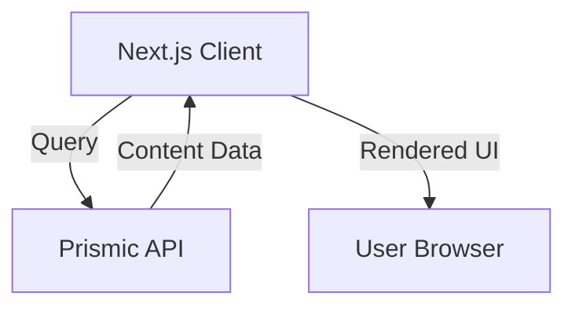

# TimBuilding Landing Page: Project Summary

## 1. Project Overview

TimBuilding Landing Page is a modern and responsive website designed to showcase TimBuilding's services and expertise. The project leverages Prismic CMS for content management, allowing for a dynamic and scalable solution. The frontend is built using Next.js and styled with Tailwind CSS for a sleek and efficient UI.

## 2. Technical Architecture

### 2.1 Frontend Stack
- Framework: Next.js
- Language: JavaScript/TypeScript
- UI Framework: Tailwind CSS
- Content Management: Prismic CMS
- Queries: Prismic CMS Next.js SDK
- Routing: Next.js App Router
- Optimization:
  - Image optimization with Next.js Image component
  - Code splitting and lazy loading for improved performance
- Deployment: Vercel

### 2.2 Backend Considerations
- Database: Prismic CMS (No direct backend access)
- API Integration: Fetching data via Prismic API
- Authentication: Not applicable (static landing page)
- Server Functions: Next.js server-side rendering (SSR) and static site generation (SSG) for performance

### 2.3 Development Environment
- OS: macOS
- IDE: VS Code
- Package Manager: npm or yarn
- Version Control: Git (GitHub)
- Prismic CMS Setup:
  - Custom types defined within Prismic
  - Slice Machine for reusable UI components
  
## 3. Data Flow Architecture

## 4. Performance Optimization

### 4.1 Frontend Optimization
- Static site generation (SSG) where possible
- Incremental static regeneration (ISR) for dynamic content updates
- Optimized images with Prismic Next Image component
- CSS and JavaScript minification
- Lazy loading for assets and components

### 4.2 API Optimization
- Optimized API calls with Prismic CMS SDK
- Caching strategies for frequently accessed content
- Reduced payload size by fetching only necessary data

## 5. Future Roadmap

### 5.1 Short-term Goals
- Complete Prismic CMS content modeling
- Implement core landing page sections (hero, services, testimonials, contact)
- Optimize for SEO and page speed

### 5.2 Mid-term Goals
- Integrate basic analytics tracking
- Enhance UX with interactive elements
- Implement accessibility improvements

### 5.3 Long-term Vision
- Expand the website with a blog or case studies section
- Add multi-language support
- Implement A/B testing for content optimization

This project summary outlines the key technical aspects of the TimBuilding Landing Page, ensuring a structured and efficient development process using Next.js, Tailwind CSS, and Prismic CMS.

